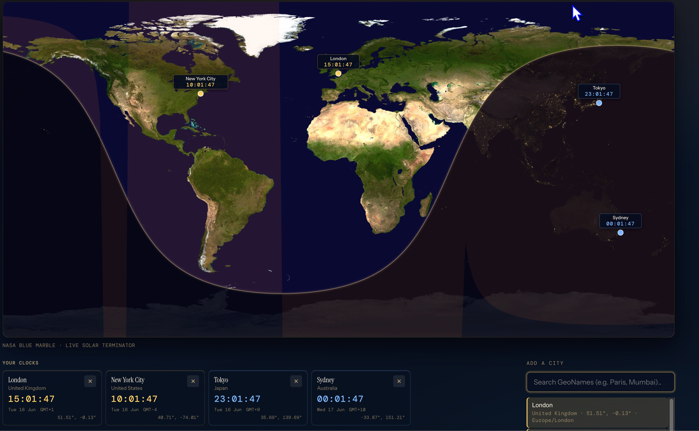

# Chronosphere — World Time

A browser widget for live world clocks and a stitched day–night Earth map. Cities are loaded from the **GeoNames** API (with coordinates and IANA timezone). The map uses NASA **Blue Marble** daylight imagery with a night-lights texture clipped to the live **solar terminator**.



## Setup

1. Register a free GeoNames account: https://www.geonames.org/login  
2. Enable webservices on your account page.  
3. Copy the example env file and add your username:

```bash
cp .env.example .env
# Edit .env → VITE_GEONAMES_USERNAME=your_username
```

Without a username the app falls back to GeoNames `demo` (strict rate limits).

## Run locally

```bash
npm install
npm run dev
```

GeoNames requests are proxied through Vite at `/api/geonames` to avoid CORS issues.

## Build

```bash
npm run build
npm run preview
```

## Project layout

```
src/
  types/city.ts         # City model
  data/seedCities.ts    # Default clocks + offline fallback
  lib/
    geonames.ts         # GeoNames search + timezone lookup
    solar.ts            # Sun position & terminator geometry
    time.ts             # Timezone formatting
  components/           # React UI
public/textures/
  earth-day.jpg         # NASA Blue Marble (2048×1024)
  earth-night.jpg       # Night lights (2048×1024)
```

## Mobile & watch path

Logic in `types/`, `data/`, and `lib/` is portable. For iOS, Android, and watch targets later, use **Expo** (React Native) and rebuild `components/` with `react-native-svg`.

## The day–night line

The boundary between daylight and darkness is the **solar terminator**. On a flat **equirectangular** map it appears as the characteristic wave sweeping across the globe.
